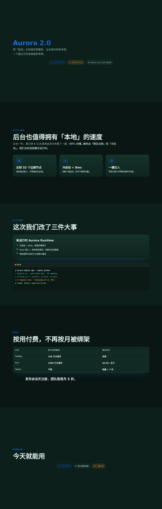

<div align="center">

# 🎬 DeckForge

**一个 JSON，生成一套高质感、可交互、自动翻页的 HTML 演示。**
说得出口的花钱 PPT，其实是个零依赖的本地工具。

`npx` · `curl | sh` · 无需任何运行时 · 单文件输出

<br>
<b>真实产物截图 — 同一 JSON，一键换装、一键导出</b>
<br>

<br><br>
<p align="center"><sub>逐页截图见 <code>export/readme/orca-herdr-pages/</code></sub></p>
<br><br>


</div>

---

## 它解决什么

想快速产出一套**能看得下去的演示**，不用手写一大堆 HTML/CSS/JS；更想让 **Claude Code / Codex / 任何 agent** 说一句话就生成一套动画幻灯片。

- ✅ 你写**内容**（一个 JSON），工具给**质感**（统一的动画引擎、图标、主题体系）。
- ✅ **零依赖**：输出是自包含 `.html`，双击即播，无 npm / 无框架 / 无网络。
- ✅ **一行命令**：内置 `--watch` 热重载、7 套主题、3 套 **frame 版式**、`--dark` 深色、`--accent` 自定义主色。
- ✅ **交互式脚手架** `--init` / `--new`：不用写 JSON 也能起头。
- ✅ **一键导出**：`tools/capture.py` 用无头 Chromium 输出 PDF / 长图 / 逐页 PNG（也用来生成真实作品墙截图）。
- ✅ 翻页、滚动、细光标、右侧竖线、屏内长内容自滚、终端逐行打字、进入页分层渐入……全部内建。

> 引擎（frame）一次写死、内容用 **block DSL** 描述 —— 换主题改一个变量即可全站变色。这是它比「每次让模型手写 CSS」更稳定、更可控的根本原因。

---

## 快速开始

**方式一 · npm / npx（无需 clone）**
```bash
npx deckforge examples/orca-herdr.json -o out.html
open out.html            # macOS
```

**方式二 · curl 一键安装**
```bash
curl -fsSL https://raw.githubusercontent.com/liulao-space/deckforge/main/install.sh | sh
deckforge examples/orca-herdr.json -o out.html
```

**方式三 · 源码直接跑（仅需 Python 3，纯标准库）**
```bash
python3 build.py examples/orca-herdr.json -o out.html --preset violet
python3 build.py examples/orca-herdr.json -o out.html --watch   # 改 JSON 自动重生成
```

**快速起手 · 不写 JSON**
```bash
deckforge --init                    # 交互式问答生成 content.json + 预览
deckforge --new "城市交通方案"      # 一行生成骨架 content.json
```

**导出 PDF / PNG / 逐页截图**（用无头浏览器，作品墙也用它产出真实截图）
```bash
pip install playwright && python -m playwright install chromium
python tools/capture.py out.html -o out.png --format png     # 长图
python tools/capture.py out.html -o out.pdf --format pdf     # PDF
python tools/capture.py out.html -o pages/ --format pages    # 逐页
```

**被 AI / agent 复用** —— 把 `SKILL.md` 交给 Claude Code，它就会自己写 JSON、自己构建：
```bash
npx skills add <your-repo> --skill deckforge -g
```

---

## 内容怎么写

三种起点，按需选一种：

**① 交互式生成（推荐新手）** —— `--init` 问答式起头，不用懂 JSON：
```bash
deckforge --init
#   Deck 标题 [我的演示] » 城市交通方案
#   主题 preset (teal/ocean/violet/sunset/rose/mono/emerald) [teal] » sun
#   想生成几页内容示例? [5] » 5
#   一句话主题关键词 [产品发布] » 地铁调度
#   → 生成 content.json + content.html，编辑 json 再 --watch
```

**② 一行骨架** —— `--new "<标题>"` 生成最小可用模板（封面+背景+结论 3 页），快速占位：
```bash
deckforge --new "新能源技术周会"      # 生成 content.json
```

**③ 手写** —— 一个 `content.json` 由 `title` + `slides[]` 组成，每页用「块（block）」拼装：
```jsonc
{
  "title": "我的演示",
  "accent": "#12876f",
  "slides": [
    {
      "align": "center",
      "title": "欢迎页标题",
      "lead": "一句话说明……",
      "blocks": [
        { "type": "pills", "items": [ { "text": "一行标签", "icon": "i-globe", "kind": "b" } ] }
      ]
    }
  ]
}
```

### 内置块类型

| type | 作用 |
|---|---|
| `pills` | 胶囊标签，支持 icon / kind(b=主色 am=琥珀 plain) |
| `cards` | 卡片网格，`cols` 控制列数，tile 或 num 徽标 |
| `card-list` | 带图标(icon)的列表卡 |
| `terminal` | 动态逐个敲出的终端（多 agent 特效核心） |
| `table` | 对比表，`marks` 支持 ✓/✗/△ 着色 |
| `vs` | 左右对比（battle 页，带 VS 徽章） |
| `flow` | 决策/流程节点（配 `tile` 图标） |
| `steps` | 步骤列表（教程/实操），可带代码块 |
| `warn` | 黄底提示条（附警告图标） |
| `quote` | 强调金句 |

**内联标记**：`**加粗**`、`` `code` ``、`[链接](url)`、`<br>`（换行）。

**图标**：`icon` / `tile` 字段填图标名（推荐无 `i-` 前缀；带前缀也兼容），见 `templates/icons.svg`。支持 ORCA / HERDR / 终端 / 分支 / 机器人 / 地球 / 眼睛 等 20+ 个线性图标，直接追加 `<symbol>` 即可自定义。

---

## 构建 & 导出

**构建（HTML，动画可交互）**
```bash
python3 build.py content.json -o out.html                 # 默认 teal，clean 版式
python3 build.py content.json -o out.html --preset violet  # 换主题
python3 build.py content.json -o out.html --dark           # 深色
python3 build.py content.json -o out.html --frame bold     # 换版式
python3 build.py content.json -o out.html --watch          # 改 json 热重载
```

**导出（PDF / 长图 / 逐页 PNG，用无头 Chromium）**
```bash
pip install playwright && python -m playwright install chromium
python tools/capture.py out.html -o out.png  --format png     # 一张长图（所有 slide 竖向拼）
python tools/capture.py out.html -o out.pdf  --format pdf     # 多页 PDF（适合共享/打印）
python tools/capture.py out.html -o pages/   --format pages   # 每页一张 PNG（作品墙素材）
python tools/capture.py out.html -o out.png  --width 1280 --height 800 --delay 1400
```

> `capture` 会临时把 deck 展平、隐藏光标/竖线/侧栏，等动画稳定后再截图，所以每页都是「干净的一屏」。

---

## 主题 & 版式（frame）

一整套 deck 的外观看两块：**preset（配色）** + **frame（版式）**，都由命令行指定。

### preset — 配色
| 预设 | 主色 | 深色版 |
| --- | --- | --- |
| `teal`（默认） | `#12876f` | `--preset teal --dark` |
| `ocean` | `#1a73e8` | 同上 |
| `violet` | `#7c3aed` | 同上 |
| `sunset` | `#d9480f` | 同上 |
| `rose` | `#c2255c` | 同上 |
| `mono` | `#292929` | 同上 |
| `emerald` | `#0b7a5c` | 同上 |

`--accent "#<hex>"` 可覆盖任何 preset。深色模式下卡片、文字、描边、光标、竖线、阴影自动翻转。示例与画廊见 [examples/README-gallery.md](examples/README-gallery.md)。

### frame — 版式（不只换色，还换排版气质）
| frame | 用途 |
|---|---|
| `clean`（默认） | 均衡网格，通用 |
| `bold` | 超大紧密标题、无卡片描边、深阴影、悬停上浮 —— 发布会/大场面 |
| `minimal` | 大量留白、细描边、透明卡片 —— 极简/教学/高级感 |

> 一个变量（`--preset`）换全站配色；一个变量（`--frame`）换整站版式。二者可任意组合，内容不动。

---

## 目录结构

```
deckforge/
├─ build.py              # CLI + 渲染引擎（纯 stdlib，可二次开发）
├─ bin/deckforge.js      # npx / npm 入口（转发到 build.py）
├─ templates/
│  ├─ base.css           # 风格骨架（动画/卡片/终端/表格/光标/侧栏 + frame 版式）
│  ├─ base.js            # 传输层（翻页/滚动/光标/侧栏/逐行动画）
│  └─ icons.svg          # 线性图标集（可扩展）
├─ tools/
│  ├─ capture.py         # 无头浏览器导出（PDF/长图/逐页 PNG）
│  ├─ validate.js        # CI 校验（JS 语法 + 图标引用完整性）
│  └─ posters.py         # 主题海报/作品墙素材
├─ examples/             # 内容示例（product-launch / teaching / architecture / orca-herdr …）
├─ outputs/              # 已构建的成品 .html
├─ export/               # 导出截图/PDF
├─ install.sh            # curl 一键安装（注册 deckforge 命令）
├─ SKILL.md              # 给 AI agent 的复用说明
└─ package.json          # npx 分发
```

---

## 为什么好用（对开发者）

- **框架/内容分离** → 改内容不动样式；改主题不动内容。
- **零依赖、单文件** → 不需要 npm、不需要 build，`python3` 即可。
- **自带完整交互** → 一屏一屏滚动、屏内长内容自滚、细光标、右侧竖线 + 当前页标题、进入页分层渐入、终端逐行打字。
- **易于产出素材** → 对输出页截图/GIF 即成 README 展示素材。

---

## Roadmap

- [x] 主题 preset 体系（7 套 + `--dark` + `--accent` 覆盖）
- [x] npx / curl 一键安装
- [x] 多示例 + 主题作品墙（posters）
- [x] CI（构建 + JS/图标校验）与 CONTRIBUTING
- [x] 无头浏览器真实截图 / 导出流水线（PDF / 长图 / 逐页 PNG）
- [x] `--init` 交互式脚手架 + `--new` 骨架生成
- [x] 多套 frame 版式（clean / bold / minimal）
- [ ] 更多主题 preset（渐变紫、发布会风…）
- [ ] 更多 frame 版式（发布会/教学/极简）

## 已知问题 / 已修复

- **图标文件头注释**：`templates/icons.svg` 必须用 `<!-- -->` 注释；若手滑写成 `/* */`，
  注释内容会当作文本渲染，导致页面顶部出现 `<symbol id="i-...">` 乱码、标题下移。
  （已修复）
- **滚轮偶尔连翻多屏**：触控板单次手势会产生大量小幅 `deltaY`，引擎现改为**累计阈值**，
  单次手势恰好翻一屏，动画进行中忽略输入，且停顿 ~240ms 后累计自动清零。（已修复）
- **深色模式边框颜色写死**：`--line` 原先硬编码为 teal 色调，换任何其他 preset 的
  深色版边框都不跟色；现在由 accent 自动派生。（已修复）
- **输出 HTML 注入**：`terminal`/`steps.code`/`cards.num`/`table.marks`/`vs.badge`
  等字段原样拼入 HTML，`**`/反引号标记也不配对；现在统一转义、白名单校验，
  `icon` 名自动补 `i-` 前缀（带不带前缀都能用）。（已修复）

## 贡献 & 许可

欢迎 PR —— 尤其是**新块类型、新主题、新图标**，这三类是凑 star 最快的。开源许可见 [LICENSE](LICENSE)。

---

<div align="center">
  ⭐ 觉得有用就点个 star，让更多人做得出好看的幻灯片。
</div>
